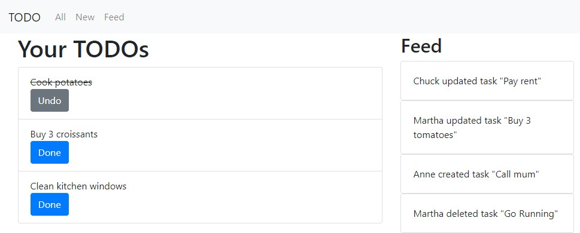

# Go Buffalo with Turbo Powers

Modern, user-friendly web applications powered by Server Rendered HTML? This example shows how to build a modern, user-friendly web application based on HTML and the [hotwire](https://hotwire.dev/) approach. We will develop a server rendered web application in [Go]() with [Buffalo](http://gobuffalo.io) enhanced by the [Turbo]() that powers [Basecamps](https://basecamp.com/) mail service [Hey](http://hey.com/).

## Running the Example
Run the example

	$ buffalo dev

Now point your browser to [http://127.0.0.1:3000](http://127.0.0.1:3000).

You'll see the app with a list of TODOs and a feed of todos on the right:


### Using the Example without Turbo
You can also try the example without Turbo and without any JavaScript at all. To use the example without Turbo point your browser to [http://127.0.0.1:3000?skipTurbo=true](http://127.0.0.1:3000?skipTurbo=true).

## Setting up Turbo
Turbo is set up by including the Turbo JavaScript in the HTML header. In Buffalo the header is rendered by the layout template `application.plush.html`.

Add the Turbo JavaScript to [application.plush.html](templates/application.plush.html):
```html
<head>
	<script src="https://unpkg.com/@hotwired/turbo@7.0.0-beta.1/dist/turbo.es5-umd.js"></script>
	...
</head>
```

## Turbo Frame with Lazy Loading
The home pages shows a feed of todos of other users as a feed on the right. This feed is loaded lazily as [Turbo Frame](https://turbo.hotwire.dev/reference/frames)

Example for Turbo Frame in [todo/index.plush.html](templates/todo/index.plush.html):
```html
<turbo-frame class="col-4" id="feed-frame" src="/feed">
    <div class="alert alert-light" role="alert">
        Loading feed ...
    </div>
</turbo-frame>
```

## Form handling with Turbo Streams

Turbo Streams allow the server to send just fragments of HTML over the wire and only replace these fragements on the client. The example uses Turbo Streams to create new todos.


The submitted form returns a Turbo Stream if possible, see [todo.go](actions/todo.go):
```go
if acceptsTurboStream(c.Request()) {
	// Handle Turbo requests
	turboAction := "replace"
	turboDomID := "todo_new_form"
	return c.Render(http.StatusOK, r.Func("text/html; turbo-stream=*", createTurboWriter("todo/new.plush.html", turboAction, turboDomID)))
}
// Handle normal requests
return c.Render(http.StatusOK, r.HTML("todo/new.plush.html"))
```
## What Next?

Check out how to use Turbo Streams over WebSockets in my example [github.com/remast/go_websocket_turbo](https://github.com/remast/go_websocket_turbo)

A must is the full hotwire demo implmented in Go [github.com/while1malloc0/hotwire-go-example](https://github.com/while1malloc0/hotwire-go-example).